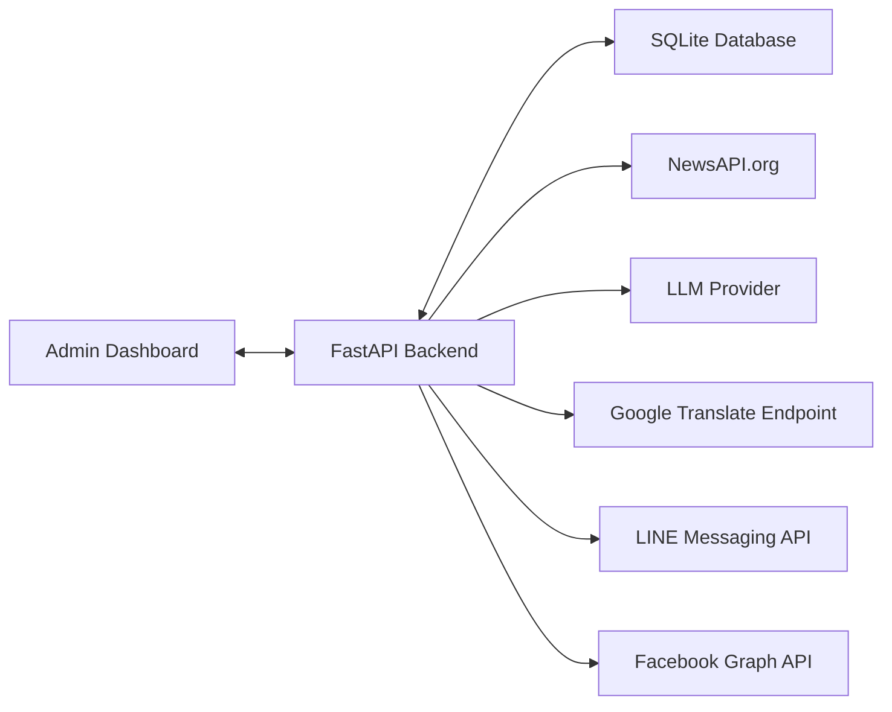
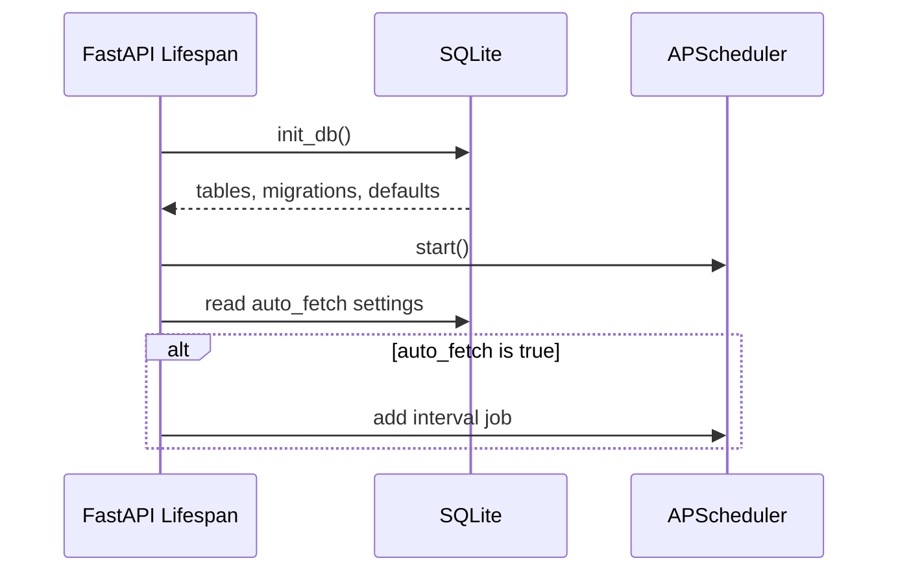
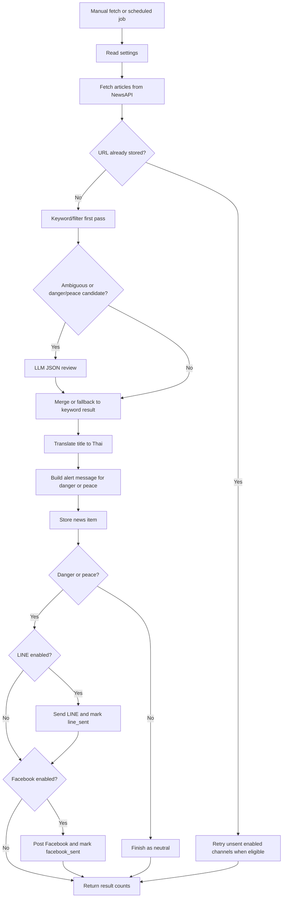

# War Alert Bot - Design Document

## 1. Product Overview

War Alert Bot is a web-administered alert system for conflict-related news. It combines a FastAPI backend, SQLite persistence, scheduled jobs, external news and notification APIs, and a static Thai-language admin dashboard.

The design favors simplicity: a single backend process owns API serving, scheduled fetching, news processing, database access, and static frontend delivery.

## 2. Design Principles

- Keep operating cost low.
- Make classification explainable through visible keyword lists, scores, confidence, and LLM reasoning when used.
- Keep admin workflows in one screen.
- Store all fetched items before sending or deleting.
- Track channel delivery independently for LINE and Facebook.
- Fail gracefully when external services or credentials are unavailable.

## 3. System Context

## 4. High-Level Architecture

The system is organized into these modules:

| Area | File | Responsibility |
| --- | --- | --- |
| API and orchestration | `backend/main.py` | FastAPI routes, scheduler lifecycle, fetch processing, settings updates. |
| Data model | `backend/models.py` | SQLAlchemy models, SQLite engine, default settings, lightweight migrations. |
| News fetching | `backend/news_fetcher.py` | NewsAPI request construction, article parsing, publish date parsing. |
| Classification | `backend/analyzer.py` | Keyword scoring, planned hybrid LLM review, and alert message construction. |
| Translation | `backend/translator.py` | Thai detection and title translation fallback. |
| LINE delivery | `backend/line_notifier.py` | LINE push and broadcast helpers. |
| Facebook delivery | `backend/facebook_notifier.py` | Facebook Page feed posting. |
| Admin UI | `frontend/index.html` | Dashboard layout, settings forms, fetch actions, news list, channel actions. |
| Deployment | `railway.json`, `nixpacks.toml` | Railway/Nixpacks build and start commands. |
| Local scripts | `start.sh`, `stop.sh` | Local development server management. |

## 5. Runtime Flow

### 5.1 Startup

### 5.2 Fetch and Notify

## 6. Data Design

### 6.1 `news_items`

Stores every fetched article and its alert delivery status.

| Column | Purpose |
| --- | --- |
| `id` | Internal primary key. |
| `title` | Original article title. |
| `title_th` | Thai translated title when available. |
| `description` | Article description, truncated to 500 characters in processing. |
| `url` | Article URL and deduplication key. |
| `source` | Source publication name. |
| `published_at` | Article publish timestamp. |
| `category` | `danger`, `peace`, or `neutral`. |
| `alert_message` | Generated LINE-style alert message. |
| `line_sent` | Whether LINE delivery succeeded. |
| `facebook_sent` | Whether Facebook posting succeeded. |
| `created_at` | Storage timestamp. |

### 6.2 `settings`

Stores system configuration as key-value rows.

| Key | Default | Purpose |
| --- | --- | --- |
| `auto_fetch` | `false` | Enables scheduled fetching. |
| `fetch_interval_value` | `30` | Numeric scheduler interval. |
| `fetch_interval_unit` | `minutes` | Scheduler interval unit. |
| `keywords` | Conflict and peace search terms | NewsAPI search input. |
| `danger_keywords` | Attack/escalation terms | Admin-editable classifier reference. |
| `peace_keywords` | Ceasefire/de-escalation terms | Admin-editable classifier reference. |
| `negative_keywords` | Non-alert context terms | Planned terms that reduce or block false positives. |
| `classifier_mode` | `keyword` or `hybrid` | Planned switch for deterministic-only or LLM-assisted classification. |
| `llm_enabled` | `false` by default | Planned toggle for optional LLM review. |
| `max_news_age_hours` | `6` | Auto-mode lookback period. |
| `line_enabled` | `true` | Enables LINE delivery during processing. |
| `facebook_enabled` | `false` | Enables Facebook delivery during processing. |

Note: the current code persists editable danger and peace keyword settings but the classifier uses static keyword arrays in `backend/analyzer.py`. Aligning runtime classifier behavior with saved settings is a future design improvement.

### 6.3 Hybrid Classifier Design

The planned hybrid classifier keeps keyword/filter rules as the first pass and calls an LLM only when an article is ambiguous or appears to be a `danger`/`peace` candidate. This preserves speed and gives the system a deterministic fallback.

Keyword/filter pass:

- Apply weighted danger and peace keywords.
- Apply negative rules to reduce false positives, such as historical summaries, movie/game references, quoted speculation, or unrelated uses of military terms.
- Produce `category`, `confidence`, `matched_keywords`, `negative_matches`, and `reason`.

LLM review:

- Trigger only for ambiguous scores or first-pass `danger`/`peace` candidates.
- Require strict JSON output with `category`, `confidence`, `reason`, and `market_impact`.
- Treat invalid JSON, timeout, empty response, or provider failure as non-fatal and fall back to keyword/filter output.

## 7. API Design

The API is REST-like and JSON-based for admin operations. The frontend uses relative URLs, so the same FastAPI origin serves both UI and API.

### Status and Settings

- `GET /api/status` returns counts, scheduler state, last fetch time, and channel states.
- `GET /api/settings` returns all key-value settings.
- `PUT /api/settings/scheduler` validates and stores auto fetch settings.
- `PUT /api/settings/keywords` stores keyword and lookback settings.
- `PUT /api/settings/channels` stores LINE and Facebook channel states.

### News

- `GET /api/news` returns up to a requested limit, ordered by latest stored item.
- `POST /api/news/fetch` runs manual fetch and processing.
- `DELETE /api/news/{news_id}` deletes one item.
- `DELETE /api/news` clears news history.

### Delivery

- `POST /api/line/test` sends a fixed test LINE message.
- `POST /api/line/send/{news_id}` sends one stored alert message to LINE.
- `POST /api/facebook/test` posts a fixed test Facebook message.
- `POST /api/facebook/send/{news_id}` posts one stored alert message to Facebook.

## 8. Admin UI Design

The admin UI is a single HTML file using embedded CSS and JavaScript.

### Layout

- Sticky header with online and channel badges.
- Top statistic cards.
- Left control column.
- Right news feed panel.

### Main Controls

- Manual search with optional date range.
- Alert channel toggles for LINE and Facebook.
- Auto fetch toggle and interval editor.
- Keyword and lookback editor.
- Test buttons for LINE and Facebook.

### News Feed

- Tabs for all, danger, peace, neutral, LINE sent, and Facebook posted.
- Per-item badges for category, translation, LINE status, and Facebook status.
- Alert preview for generated messages.
- Per-item send, post, open link, and delete actions.

## 9. Integration Design

### NewsAPI

The backend sends a query to `https://newsapi.org/v2/everything` with:

- Query built from up to five comma-separated keywords.
- English language filter.
- Date range from manual inputs or auto lookback.
- `sortBy=publishedAt`.
- `pageSize=100`.

### Google Translate

The backend uses `https://translate.googleapis.com/translate_a/single` as an unofficial free translation endpoint. Failure falls back to the original title.

### LLM Classification Provider

Hybrid mode may call an LLM provider after keyword/filter pre-screening. The provider must be optional and isolated behind a small interface so the analyzer can fall back to keyword results without blocking the news pipeline.

### LINE

The backend posts to `https://api.line.me/v2/bot/message/push` with a bearer token and target user ID.

### Facebook

The backend posts to `https://graph.facebook.com/v19.0/{page_id}/feed` with message, token, and optional link.

## 10. Deployment Design

### Local

`start.sh` activates or creates `venv`, installs dependencies if needed, stops any process on the target port, and runs `backend/main.py`.

`stop.sh` kills a process using the configured port.

### Railway

Railway uses Nixpacks:

- Build: `pip install -r backend/requirements.txt`
- Start: `cd backend && python main.py`

## 11. Design Limitations

- No admin authentication is currently enforced.
- SQLite database file location is relative to the backend working directory.
- Saved classifier keywords are not currently injected into `analyze_news`.
- Hybrid LLM classification, negative rules, weighted keywords, and confidence storage are documented as planned behavior and are not yet implemented.
- `env.example` currently contains values that look like real credentials and should be sanitized.
- The frontend depends on external Google Fonts.
- The translation endpoint is unofficial and may change behavior.
- Scheduler runs in-process, so multi-instance deployment could duplicate scheduled jobs.

## 12. Recommended Improvements

- Add admin authentication using `ADMIN_SECRET` or another secure method.
- Sanitize example environment files and rotate exposed tokens.
- Wire persisted danger and peace keyword settings into the analyzer.
- Implement hybrid classifier mode with weighted keywords, negative rules, confidence score, strict LLM JSON output, and deterministic fallback.
- Add tests for classifier, NewsAPI parsing, settings validation, and send retry behavior.
- Add structured logging.
- Add database retention or archive policy.
- Add source filtering and richer admin audit history.
